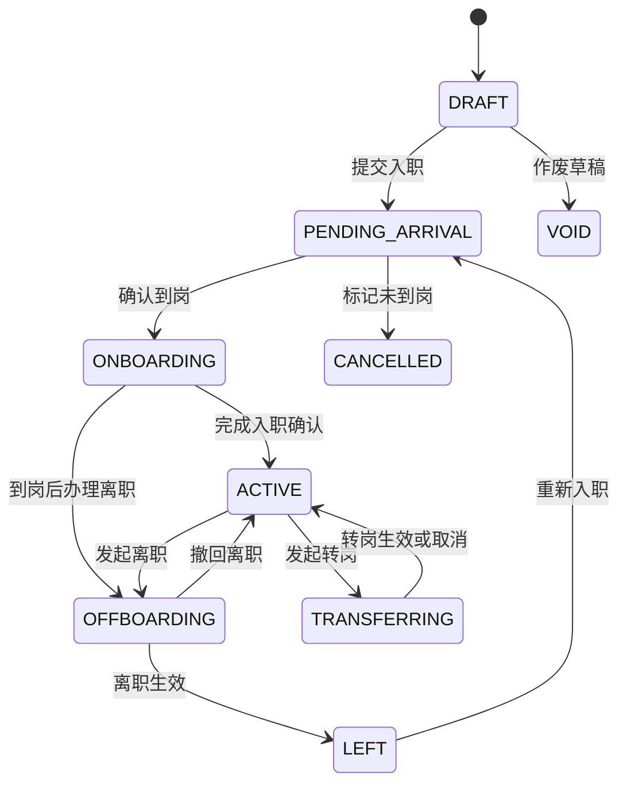

# 优益数字化管理系统——驻厂管理平台 V1.0 完整 PRD

> 文档版本：V1.0  
> 编制日期：2026-08-05  
> 适用系统：`hr-roster-system`  
> 核心目标：简化驻厂人员操作、降低未投保及异动风险、准确核算招聘人和供应商来源。

## 1. 需求概述

现有系统已经包含花名册、客户项目、驻厂人员、保险提示、调岗、离职、风险预警、权限和操作日志。本次不推翻现有系统，而是在现有数据和接口基础上建立“员工生命周期 + 自动待办”的驻厂业务闭环。

核心流程：

```text
新增员工 → 招聘来源确认 → 计划到岗 → 实际到岗 → 投保/合同/资料
        → 正常在职 → 转岗 → 离职交接 → 退保/工资结算 → 已离职
```

本次明确取消“项目主管”角色，其现场职责全部合并到“驻厂人员”。高风险事项由企业 HR 或企业管理员复核。

## 2. 建设目标

1. 驻厂人员单人入职操作时间控制在 3 分钟以内。
2. 到岗后投保待办生成率达到 100%。
3. 员工招聘来源完整率达到 100%，来源仅允许“招聘人”或“供应商”。
4. 转岗不得覆盖原任职记录，任职历史完整率达到 100%。
5. 离职自动联动退保、工资结算和现场交接。
6. 所有待办必须有责任人、截止时间和处理留痕。
7. 驻厂人员只能访问授权项目数据，不得查看公司级敏感数据。

## 3. 用户角色

| 角色 | 核心职责 | 数据范围 |
|---|---|---|
| 驻厂人员 | 新增员工、确认到岗、投保、项目内/跨项目转岗、离职交接、现场风险上报 | 授权项目 |
| 企业 HR | 合同保险复核、跨客户转岗复核、黑名单复核、招聘来源修改审批 | 本企业或授权项目 |
| 财务人员 | 工资、预支、招聘费用、离职工资结算 | 授权项目 |
| 企业管理员 | 客户项目、账号权限、项目配置、审计与全部审批 | 本企业全部数据 |

不再设置项目主管。原项目主管账号迁移为驻厂人员，并保留原授权项目。

## 4. 产品范围

### 4.1 V1.0 必须实现

- 驻厂工作台。
- 员工生命周期状态机。
- 分步骤新员工录入。
- 身份证重复、黑名单、有效任职预检查。
- 招聘人和供应商管理。
- 计划到岗、实际到岗、未到岗处理。
- 投保、合同、资料自动待办。
- 项目内、跨项目、跨客户转岗。
- 离职交接、退保和工资结算联动。
- 统一待办中心。
- 项目数据权限、敏感字段脱敏和操作日志。
- 旧数据迁移和灰度开关。

### 4.2 暂不纳入 V1.0

- 供应商费用自动付款。
- 第三方电子合同正式签署。
- 完整工伤理赔流程。
- 招聘平台自动同步。
- 人脸识别考勤。
- 复杂供应商评级模型。

## 5. 信息架构

### 5.1 驻厂人员菜单

```text
工作台
员工管理
├── 员工花名册
├── 新增员工
├── 转岗办理
└── 离职办理
待办中心
保险管理
招聘来源
├── 招聘人
└── 供应商
现场风险
我的
```

### 5.2 企业 HR 菜单

```text
运营总览
客户项目
员工管理
招聘管理
├── 招聘人
├── 供应商
├── 招聘批次
└── 招聘质量统计
合同保险
用工风险
操作日志
```

### 5.3 手机端底部导航

```text
工作台｜待办｜员工｜我的
```

新增员工作为工作台主按钮，不占用底部导航。

## 6. 驻厂工作台

### 6.1 页面模块

1. 当前项目和项目切换器。
2. 当前在岗、今日入职、今日离职、待处理、高风险员工。
3. 新增员工、确认到岗、办理转岗、办理离职快捷入口。
4. 高风险待办。
5. 今日到期和已逾期待办。
6. 最近入职、转岗、离职动态。

### 6.2 展示规则

- 只有一个授权项目时隐藏项目切换器。
- 多项目切换后，全部统计和列表同步过滤。
- 高风险待办优先于普通消息。
- 驻厂首页不展示利润、客户回款和公司级工资金额。
- 所有统计卡片均可进入对应明细。

## 7. 员工生命周期

### 7.1 主状态

| 状态码 | 名称 | 说明 |
|---|---|---|
| `DRAFT` | 草稿 | 尚未完成提交 |
| `PENDING_ARRIVAL` | 待到岗 | 入职资料已提交 |
| `ONBOARDING` | 入职办理中 | 已到岗但合规事项未全部完成 |
| `ACTIVE` | 在职 | 员工有效任职 |
| `TRANSFERRING` | 转岗处理中 | 存在待生效转岗单 |
| `OFFBOARDING` | 离职处理中 | 已发起离职 |
| `LEFT` | 已离职 | 离职生效并完成现场确认 |
| `CANCELLED` | 入职取消 | 计划到岗但未实际到岗 |
| `VOID` | 档案作废 | 重复或错误录入，且没有正式业务记录 |

### 7.2 状态流转



### 7.3 独立合规状态

员工主状态不得代替下列状态：

- 到岗状态：待确认、已到岗、未到岗。
- 保险状态：待投保、处理中、待生效、保障中、待退保、已退保、失败。
- 合同状态：待签、已签、即将到期、已到期、已终止。
- 资料状态：不完整、完整、存在异常。
- 风险等级：低、中、高。

## 8. 新员工录入

### 8.1 第一步：身份信息

| 字段 | 必填 | 规则 |
|---|---:|---|
| 姓名 | 是 | OCR 带出，可核对修改 |
| 身份证号码 | 是 | 18 位校验，加密保存、哈希查重 |
| 手机号 | 是 | 11 位手机号码 |
| 身份证正面 | 是 | 图片附件 |
| 身份证反面 | 是 | 识别证件有效期 |
| 性别、出生日期、年龄 | 自动 | 根据身份证计算 |
| 紧急联系人及电话 | 否 | 手机端可后补 |

进入下一步前调用预检查接口，检查：

- 身份证格式和有效期。
- 同企业重复档案。
- 其他项目有效任职。
- 企业黑名单。
- 年龄和岗位限制。
- 未结工资预支。
- 特种岗位证件要求。

### 8.2 第二步：任职安排

| 字段 | 必填 | 规则 |
|---|---:|---|
| 客户单位 | 是 | 根据当前项目自动带出 |
| 项目/厂区 | 是 | 默认当前授权项目 |
| 部门/车间 | 是 | 项目字典选择 |
| 岗位 | 是 | 项目有效岗位 |
| 班次 | 否 | 白班、夜班、两班倒等 |
| 用工模式 | 是 | 全职、兼职、劳务、实习、外包、派遣 |
| 工资类型 | 是 | 计时、计件、混合 |
| 入职日期 | 是 | 默认当天 |
| 计划到岗时间 | 是 | 支持精确到小时 |
| 住宿安排 | 否 | 不住宿、待安排、已安排 |

费用模式和工资标准由项目/岗位配置自动带出，驻厂人员默认只读。

### 8.3 第三步：招聘来源

来源类型仅允许：

```text
招聘人
供应商
```

| 来源类型 | 必填字段 |
|---|---|
| 招聘人 | `recruiter_id` |
| 供应商 | `supplier_id`，可选供应商推荐人 |

两类来源互斥，不允许自由文本作为正式来源。可保留 `legacy_source_text` 用于旧数据迁移。

### 8.4 第四步：资料与合规

根据项目和岗位动态展示：

- 银行卡。
- 健康证。
- 上岗证。
- 特种作业证。
- 员工照片。
- 其他项目要求资料。

### 8.5 提交结果

提交成功后：

1. 创建员工档案。
2. 创建待生效任职记录。
3. 保存招聘来源。
4. 生成到岗确认任务。
5. 根据配置生成投保、合同和资料任务。
6. 写入操作日志。

整个过程必须使用数据库事务和幂等键。

## 9. 到岗和未到岗

### 9.1 确认到岗

驻厂人员填写实际到岗时间、实际项目、车间和岗位。确认后：

- 员工状态改为 `ONBOARDING`。
- 任职记录生效。
- 招聘来源锁定。
- 未投保时生成高风险投保任务。
- 合同未签时生成合同任务。
- 缺资料时生成资料任务。
- 更新招聘批次到岗人数。

### 9.2 未到岗

未到岗不属于离职，使用 `CANCELLED` 状态。原因包括：

- 员工主动放弃。
- 联系不上。
- 客户取消需求。
- 面试或体检未通过。
- 资料异常。
- 供应商取消输送。
- 已入职其他企业。

关闭未开始的投保和合同任务，保留招聘来源和跟进记录。未到岗不得计入离职率。

## 10. 保险管理

### 10.1 保险状态

```text
NOT_REQUIRED
PENDING
PROCESSING
PENDING_EFFECTIVE
ACTIVE
EXPIRING
EXPIRED
TERMINATING
TERMINATED
FAILED
```

### 10.2 提醒规则

| 场景 | 风险等级 | 动作 |
|---|---|---|
| 到岗时保险未生效 | 高 | 立即生成投保任务 |
| 投保处理中但尚未生效 | 高 | 保持风险提醒 |
| 保险 30 天内到期 | 中 | 生成续保提醒 |
| 离职后保险仍有效 | 高 | 生成退保任务 |
| 投保失败 | 高 | 生成重新投保任务 |

投保字段必须包括保险类型、承保机构、保单号、生效时间、到期时间、保额、回执附件、经办人和经办时间。

## 11. 转岗管理

### 11.1 转岗类型

| 类型 | 流程 |
|---|---|
| 项目内转岗 | 驻厂人员发起并确认 |
| 跨项目转岗 | 原项目驻厂人员发起，目标项目驻厂人员接收 |
| 跨客户转岗 | 驻厂人员发起，企业 HR 复核 |

### 11.2 必填字段

- 原项目、车间、岗位，系统带出。
- 新项目、车间、岗位。
- 生效日期。
- 转岗原因。
- 工资方案是否变化。
- 保险是否需要变更。
- 合同是否需要补充协议。

### 11.3 业务规则

- 不得覆盖原任职记录。
- 原任职结束日期为新任职生效日前一天。
- 员工存在离职流程时禁止转岗。
- 同一员工只能存在一个未完成转岗单。
- 目标项目拒绝时保留原任职。
- 转岗生效后重新检查保险、合同、证件和工资方案。

## 12. 离职管理

### 12.1 离职信息

- 离职类型：主动离职、辞退、合同到期、自离。
- 最后工作日。
- 离职原因分类：员工、企业、项目、风险、其他。
- 离职原因和说明。
- 是否允许再次入职。

### 12.2 现场交接

- 工牌。
- 工服和工具。
- 宿舍。
- 考勤确认。
- 其他项目配置项。

### 12.3 系统联动

离职发起后自动生成：

- 现场交接任务。
- 工资结算任务。
- 保险退保任务。
- 合同终止任务。

驻厂人员只负责现场交接和考勤确认，不确认最终工资金额。员工加入黑名单必须由企业 HR 或管理员复核。

## 13. 招聘人和供应商

### 13.1 招聘人

记录编号、姓名、手机号、关联账号、主要项目、结算模式、单价、启停状态。停用后不能关联新员工，但保留历史员工。

### 13.2 供应商

记录供应商编号、名称、统一社会信用代码、联系人、合同有效期、结算模式、风险等级和状态。

规则：

- 合同过期或供应商停用时禁止关联新员工。
- 历史员工来源不受影响。
- 到岗后来源锁定。
- 修改来源必须经过企业 HR 审批，并重新计算未结招聘费用。

### 13.3 统计口径

- 报名人数。
- 计划到岗人数。
- 实际到岗人数。
- 当前在岗人数。
- 到岗率。
- 7 天留存率。
- 30 天留存率。
- 未到岗人数。
- 企业原因和员工原因离职数。

## 14. 统一待办中心

### 14.1 待办类型

- 到岗确认。
- 投保、续保、退保。
- 合同签署和终止。
- 资料补充。
- 跨项目转岗接收。
- 离职交接。
- 工资结算。
- 证件到期。
- 供应商合同续签。

### 14.2 状态

```text
待处理 → 处理中 → 已完成
                 ↘ 已关闭
```

高风险任务不能直接手工关闭，必须通过对应业务动作完成。任何待办都必须有责任人。

### 14.3 分配顺序

```text
业务指定责任人
→ 项目主驻厂人员
→ 项目协同驻厂人员
→ 企业 HR
→ 管理员异常队列
```

## 15. 页面清单

| 页面 | 路由 | 主要角色 |
|---|---|---|
| 驻厂工作台 | `/workbench` | 驻厂人员 |
| 员工列表 | `/employees` | 驻厂、HR |
| 新增员工 | `/employees/create` | 驻厂、HR |
| 员工详情 | `/employees/:id` | 驻厂、HR、财务部分可见 |
| 转岗办理 | `/employees/:id/transfer` | 驻厂、HR |
| 离职办理 | `/employees/:id/offboarding` | 驻厂、HR |
| 待办中心 | `/tasks` | 全角色按权限 |
| 保险管理 | `/insurance` | 驻厂、HR |
| 招聘人 | `/recruitment/recruiters` | 驻厂、HR |
| 供应商 | `/recruitment/suppliers` | HR、驻厂查看 |
| 招聘批次 | `/recruitment/batches` | HR |
| 招聘统计 | `/recruitment/statistics` | HR、管理员 |

## 16. 员工列表优化

默认字段：

```text
姓名/工号｜项目/岗位｜员工状态｜入职日期｜招聘来源
保险｜合同｜资料｜风险｜操作
```

详情字段不在主表全部展开。操作按状态动态显示：

| 状态 | 操作 |
|---|---|
| 草稿 | 继续填写、作废 |
| 待到岗 | 确认到岗、未到岗、编辑 |
| 入职办理中 | 投保、合同、补资料 |
| 在职 | 转岗、离职 |
| 转岗处理中 | 查看、取消 |
| 离职处理中 | 继续交接、查看进度 |
| 已离职 | 查看档案、重新入职 |

## 17. 数据库设计

### 17.1 `employees` 增加字段

| 字段 | 类型 | 说明 |
|---|---|---|
| lifecycle_status | VARCHAR(30) | 生命周期状态 |
| arrival_status | VARCHAR(20) | 到岗状态 |
| insurance_status | VARCHAR(30) | 保险状态 |
| contract_status | VARCHAR(30) | 合同状态 |
| document_status | VARCHAR(30) | 资料状态 |
| risk_level | TINYINT | 1低、2中、3高 |
| recruitment_source_type | TINYINT | 1招聘人、2供应商 |
| recruiter_id | BIGINT NULL | 招聘人ID |
| supplier_id | BIGINT NULL | 供应商ID |
| recruitment_batch_id | BIGINT NULL | 招聘批次ID |
| source_locked | TINYINT | 来源锁定 |
| source_confirmed_at | DATETIME NULL | 来源确认时间 |
| legacy_source_text | VARCHAR(255) NULL | 旧来源文本 |

### 17.2 新增表

| 表 | 作用 |
|---|---|
| `recruiters` | 招聘人 |
| `recruitment_suppliers` | 招聘供应商 |
| `recruitment_batches` | 招聘批次 |
| `employee_assignments` | 员工任职历史 |
| `employee_changes` | 入职、转岗、离职异动单 |
| `work_tasks` | 统一待办 |
| `employee_insurances` | 保险记录 |
| `project_hr_configs` | 项目驻厂规则 |
| `position_compliance_configs` | 岗位合规要求 |
| `recruitment_source_changes` | 来源变更审批 |
| `recruitment_fee_details` | 招聘费用明细，V1.0可只建表不启用结算 |

所有业务表必须包含企业ID、创建时间、更新时间、操作人和必要索引。敏感身份证使用加密字段和不可逆哈希查重。

## 18. 核心接口

### 18.1 工作台

```http
GET /api/v1/workbench/dashboard?projectId=1001
GET /api/v1/workbench/tasks?projectId=1001
```

### 18.2 员工

```http
POST /api/v1/employees/precheck
POST /api/v1/employees
GET  /api/v1/employees
GET  /api/v1/employees/:id
PUT  /api/v1/employees/:id
POST /api/v1/employees/:id/confirm-arrival
POST /api/v1/employees/:id/cancel-onboarding
GET  /api/v1/employees/:id/lifecycle
```

新增员工请求示例：

```json
{
  "name": "张三",
  "idCardNo": "410xxxxxxxxxxxx123",
  "phone": "13800138000",
  "projectId": 1001,
  "departmentId": 20,
  "positionId": 35,
  "employmentType": 5,
  "workType": 1,
  "hireDate": "2026-08-05",
  "plannedArrivalAt": "2026-08-05 08:00:00",
  "recruitmentSourceType": 2,
  "recruiterId": null,
  "supplierId": 201,
  "recruitmentBatchId": 301
}
```

### 18.3 转岗

```http
POST /api/v1/employees/:id/transfers
GET  /api/v1/transfers/:transferId
PUT  /api/v1/transfers/:transferId/accept
PUT  /api/v1/transfers/:transferId/reject
PUT  /api/v1/transfers/:transferId/cancel
```

### 18.4 离职

```http
POST /api/employees/:id/resign
PUT  /api/resignations/:resignationId/progress
```

`progress` 请求至少支持 `badgeReturned`、`toolsReturned`、`dormCleared`、`attendanceConfirmed`、`settlementStatus`。工牌、工服工具、宿舍、考勤、退保、工资结算全部完成后，系统才将员工生命周期改为 `LEFT` 并关闭当前任职。

### 18.5 招聘来源

```http
GET/POST /api/recruiters
PUT      /api/recruiters/:id
GET/POST /api/recruitment-suppliers
PUT      /api/recruitment-suppliers/:id
```

### 18.6 待办和保险

```http
GET /api/v1/tasks
PUT /api/v1/tasks/:id/assign
POST /api/v1/employees/:id/insurances
PUT /api/v1/insurances/:id
```

## 19. 接口业务要求

- 修改接口必须验证企业、项目和功能权限。
- 新增、到岗、转岗、离职必须支持 `Idempotency-Key`。
- 入职写员工、任职、来源和待办时必须使用事务。
- 后端重新校验所有前端字段。
- 接口错误必须返回明确错误码和下一步动作。
- 身份证、银行卡不得出现在 URL、日志和普通错误信息中。

主要错误码：

| 错误码 | 说明 |
|---:|---|
| 40301 | 无项目数据权限 |
| 40901 | 员工存在有效任职 |
| 40902 | 命中企业黑名单 |
| 40903 | 招聘来源已锁定 |
| 40904 | 供应商合同已过期 |
| 40921 | 存在未完成转岗单 |
| 40922 | 存在未完成离职单 |
| 40931 | 到岗员工保险未生效 |
| 40941 | 离职交接未完成 |
| 40942 | 工资预支未结清 |

## 20. 权限矩阵

| 操作 | 驻厂人员 | 企业 HR | 财务 | 管理员 |
|---|---:|---:|---:|---:|
| 新增员工 | ✓ | ✓ | — | ✓ |
| 确认到岗/未到岗 | ✓ | ✓ | — | ✓ |
| 办理保险 | ✓ | ✓ | — | ✓ |
| 项目内转岗 | ✓ | ✓ | — | ✓ |
| 跨项目转岗 | 发起/接收 | ✓ | — | ✓ |
| 跨客户转岗 | 发起 | 复核 | — | ✓ |
| 发起离职 | ✓ | ✓ | — | ✓ |
| 确认工资结算 | 查看 | 查看 | ✓ | ✓ |
| 黑名单 | 申请 | 复核 | — | ✓ |
| 修改锁定来源 | 申请 | 复核 | — | ✓ |
| 查看招聘费用 | 可配置 | ✓ | ✓ | ✓ |

## 21. 风险规则

### 21.1 高风险

- 已到岗但保险未生效。
- 命中黑名单。
- 身份证过期。
- 特种岗位无有效证书。
- 离职后保险仍有效。
- 跨客户转岗未完成合同或保险调整。
- 未成年用工或其他禁止用工情况。

### 21.2 中风险

- 合同待签或即将到期。
- 保险、健康证、特种证件即将到期。
- 资料不完整。
- 转岗接收超时。
- 供应商合同即将到期。

## 22. 通知规则

| 事项 | 首次提醒 | 升级提醒 |
|---|---|---|
| 计划到岗 | 到岗前一天 | 超过计划时间2小时 |
| 到岗未投保 | 确认到岗时 | 超过4小时通知企业 HR |
| 合同待签 | 到岗当天 | 第7天升级 |
| 跨项目转岗待接收 | 发起时 | 48小时升级 |
| 离职待退保 | 离职生效时 | 3天后升级 |
| 证件到期 | 提前30天 | 到期当天升级 |
| 供应商合同到期 | 提前30天 | 到期后自动停用 |

同一业务不得重复创建多个有效待办。

## 23. 操作日志

必须记录：

- 新增和修改员工。
- 查看完整敏感信息。
- 确认到岗和未到岗。
- 招聘来源锁定、修改申请和复核。
- 转岗发起、接收、拒绝、取消和生效。
- 离职发起、撤回、交接和完成。
- 投保、退保和回执上传。
- 黑名单申请和审批。
- 员工数据导出。
- 待办转派和关闭。

日志保存修改前后数据、操作者、时间、IP、设备和请求ID。

## 24. 安全和数据保护

- 身份证、银行卡采用 AES 等可靠方式加密入库。
- 身份证标准化后计算哈希用于查重。
- 默认脱敏展示，按权限短时查看明文。
- 合同、身份证、保单等附件使用私有对象存储。
- 附件下载链接短时有效并校验业务权限。
- 导出文件增加导出人、时间和项目范围水印。
- 账号停用后登录令牌立即失效。
- 临时驻厂人员授权必须配置有效期。

## 25. 旧数据迁移

1. 完整备份数据库。
2. 新增表和字段，不删除旧字段。
3. 为现有在职员工生成有效任职记录。
4. 映射待入职、在职、离职状态。
5. 清洗原渠道来源文本。
6. 精确匹配招聘人或供应商，无法匹配的标记待确认。
7. 根据合同、社保和保险记录计算合规状态。
8. 为现有异常生成待办。
9. 按项目核对员工总数、在职数和保险异常数。
10. 使用功能开关按项目灰度启用。

不得模糊猜测来源归属，不得直接覆盖原渠道文本。

## 26. 测试场景

必须覆盖：

1. 招聘人来源正常入职。
2. 供应商来源正常入职。
3. 身份证重复和有效任职拦截。
4. 黑名单拦截。
5. 供应商合同过期拦截。
6. 未到岗取消且不计入离职率。
7. 到岗未投保生成高风险待办。
8. 项目内转岗。
9. 跨项目接收、拒绝和取消。
10. 跨客户 HR 复核。
11. 正常离职和自离。
12. 离职存在未结预支。
13. 离职未退保。
14. 到岗后修改招聘来源。
15. 驻厂人员访问未授权项目。
16. 重复提交不产生重复员工或待办。
17. 网络中断后恢复草稿。
18. 原项目主管角色迁移。

## 27. 验收标准

### 27.1 入职

- 正常手机端入职不超过3分钟。
- 重复身份证、黑名单和有效任职能够拦截。
- 招聘来源必须选择招聘人或供应商。
- 到岗后来源自动锁定。
- 到岗、保险、合同和资料任务正确生成。

### 27.2 转岗

- 原任职记录不被覆盖。
- 跨项目必须由目标驻厂人员接收。
- 跨客户必须由企业 HR 复核。
- 转岗生效后更新当前任职并检查保险、合同、工资方案。

### 27.3 离职

- 保存最后工作日、原因和现场交接。
- 自动生成退保和工资结算任务。
- 未退保人员进入高风险列表。
- 离职员工停止正常考勤数据产生。

### 27.4 权限

- 驻厂人员只能查看授权项目。
- 驻厂人员不能直接加入黑名单。
- 驻厂人员不能直接修改锁定的招聘来源。
- 身份证和银行卡默认脱敏。

## 28. 非功能指标

| 场景 | 目标 |
|---|---:|
| 工作台加载 | ≤2秒 |
| 员工列表查询 | ≤1.5秒 |
| 身份预检查 | ≤1秒，不含OCR |
| 新增员工提交 | ≤2秒 |
| 员工详情 | ≤1.5秒 |
| 批量导入1000人 | ≤60秒 |
| 服务月可用率 | ≥99.9% |

移动端按钮有效区域不小于44×44像素，关键状态除颜色外必须显示文字。

## 29. 开发阶段

### 第一阶段：基础和入职

- 角色迁移、数据表、状态机、招聘来源、身份预检查、新增员工、到岗和未到岗。

### 第二阶段：待办和保险

- 驻厂工作台、统一待办、投保和退保联动、提醒定时任务。

### 第三阶段：异动闭环

- 项目内和跨项目转岗、跨客户复核、离职交接、工资和退保联动。

### 第四阶段：迁移和灰度

- 旧数据迁移、权限测试、单项目试点、全量推广。

## 30. 上线指标

| 指标 | 目标 |
|---|---:|
| 招聘来源完整率 | 100% |
| 到岗投保待办生成率 | 100% |
| 转岗任职历史完整率 | 100% |
| 离职退保待办生成率 | 100% |
| 待办责任人缺失率 | 0 |
| 项目越权访问 | 0 |
| 核心操作日志覆盖率 | 100% |

## 31. 最终业务原则

```text
先建档，再到岗；
到岗即查保险；
来源必须可追溯；
转岗必须留历史；
离职必须做闭环；
风险必须有责任人。
```
